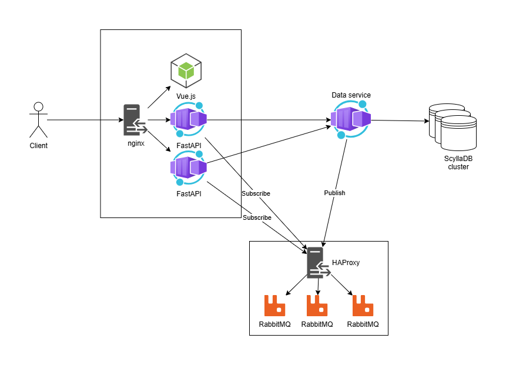

[](https://github.com/Serious-senpai/minichat/actions/workflows/lint.yml)
[](https://github.com/Serious-senpai/minichat/actions/workflows/build.yml)

# minichat

Horizontally scalable system for a minimal chat application.

### Architecture

The client's requests are initially handled by an [nginx reverse proxy](https://hub.docker.com/_/nginx), which serves a static frontend (written in [Vue.js](http://vuejs.org/)) as well as forwards traffic to 2 [FastAPI](https://fastapi.tiangolo.com/) applications. These FastAPI nodes then send gRPC requests to a data service (written in [Rust](https://www.rust-lang.org/)) connecting to a ScyllaDB cluster for persistent data storage.

When a client communicates with the FastAPI servers using WebSocket, FastAPI subscribes to the corresponding message queue of the RabbitMQ cluster. Whenever a new message is sent to a channel, the data service delivers this message to the queue corresponding to that channel.



### Deployment

Deployment using [Docker Compose](https://docs.docker.com/compose) is as easy as:
```bash
$ docker compose up -d
```
